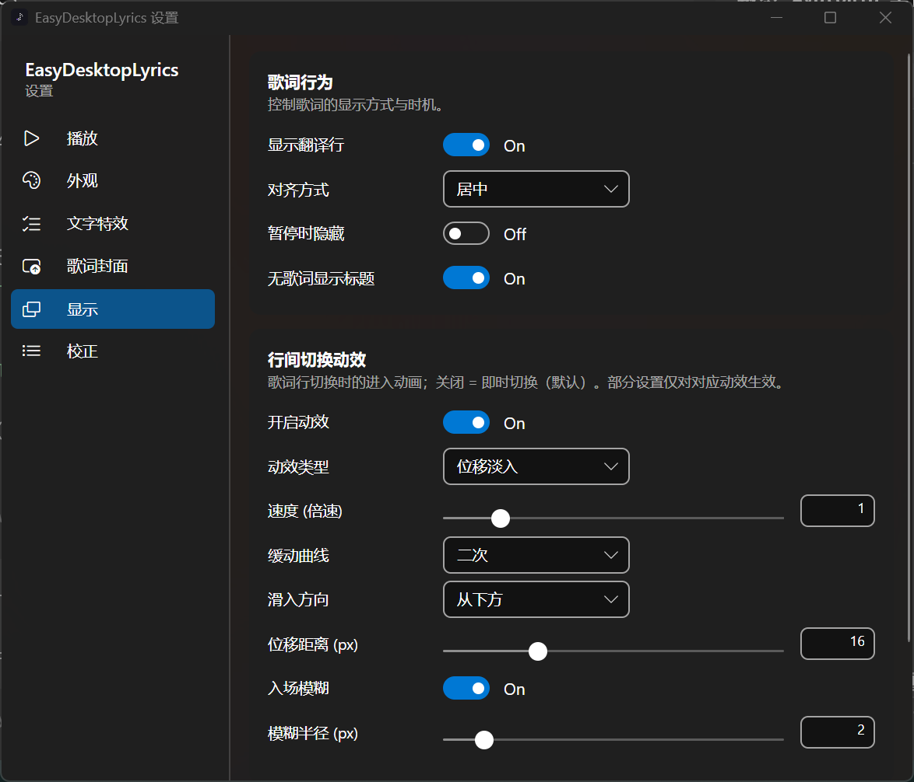
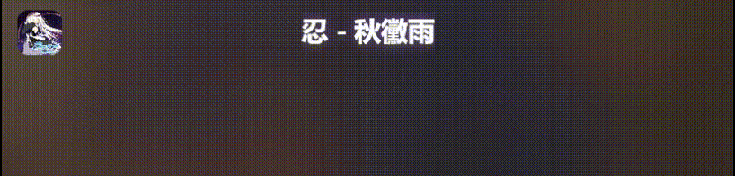

<p align="center">
  
</p>

# EasyDesktopLyrics

Windows 桌面歌词工具。通过 [SMTC](https://learn.microsoft.com/windows/uwp/audio-video-camera/system-media-transport-controls) 跟随外部播放器同步显示歌词，歌词窗口常驻桌面并支持鼠标穿透（锁定后完全不挡操作），透明、轻量、即开即用。


## 截图

歌词窗口不透明显示时随歌名/歌手变化，多行歌词 + 逐字高亮：

| 歌词窗口（无常驻封面） | 歌词窗口（含常驻封面） |
|:---:|:---:|
|  |  |

悬停歌词窗口时出现的播放控制胶囊（上一曲 / 播放暂停 / 下一曲）：


设置界面（外观、文字特效、歌词封面、行间动效、歌词来源等）：



## 动效演示

歌词行切换动画（进入动效，可在设置中调整速度、缓动、方向等）：

| 位移淡入 | 缩放弹入 |
|:---:|:---:|
|  |  |

| 扫光 | 切歌动画 |
|:---:|:---:|
|  |  |

## 功能

| 功能 | 说明 |
|------|------|
| **SMTC 同步** | 自动跟随 Spotify、网易云音乐、QQ 音乐、Apple Music、foobar2000 等任何发布 SMTC 会话的播放器 |
| **播放器优先级** | 多播放器同时播放时按列表选择跟随，可忽略指定播放器（避免浏览器等会话干扰） |
| **自动匹配歌词** | 网易云音乐 / QQ 音乐 / LRCLIB / 本地 LRC 目录多源自动匹配，来源顺序可配置 |
| **逐字歌词（实验性）** | 网易云 yrc 逐字时间戳 → 卡拉 OK 式按字高亮；无逐字数据自动回退整行高亮 |
| **翻译显示** | 原文下方显示翻译行（网易 tlyric / QQ trans），字号、行距可调 |
| **已唱 / 未唱样式隔离** | 颜色、不透明度、描边、辉光均可独立设置；未唱段默认弱化，保证逐字明暗对比 |
| **文字特效** | 阴影、描边（宽度 0.1–4）、辉光可自由组合，任意背景下保证可读性 |
| **行间切换动效** | 歌词行切换的进入/退场动画（淡入 / 位移 / 缩放 / 交叉淡化 / 逐字显现 / 扫光），速度、缓动、方向、模糊等均可自定义 |
| **背景动效** | 歌词背面的视觉效果（默认关闭，可自由组合）：**频谱**（真实音频环回采集，失败自动回退模拟；柱状图/曲线/单曲线 × 底部/行中央/顶部，高度、颜色、辉光、镜像可调）、**飘雪**（强度、范围、大小、速度、颜色可调）、**雾层**（柔和流动光晕，颜色取自窗口背后内容与封面，可配色流动） |
| **窗口锁定** | 锁定后鼠标穿透且不可拖动，歌词完全悬浮于桌面，不干扰任何操作 |
| **歌词封面** | 常驻封面显示 + 切歌居中淡入动画（可同步显示歌名/歌手），尺寸、时长、方向、缓动可调 |
| **播放控制** | 悬浮窗悬停显示上/下一曲、播放/暂停按钮，通过 SMTC 直接控制播放器 |
| **位置预设** | 九宫格一键定位 + 水平/垂直百分比微调，窗口高度扩展方向可设 |
| **手动校正** | 自动匹配不理想时手动指定歌词源/歌曲，支持单曲时间偏移 |
| **全局时间偏移** | 歌词整体提前/延后微调 |
| **托盘控制** | 显示/隐藏歌词、锁定、退出均可在托盘完成 |
| **轻量** | 免安装、解压即用，无后台服务，静态渲染时 CPU 占用约 0% |

## 使用

每个版本发布两种包，按需选择其一：

| 包 | 说明 |
|------|------|
| `EasyDesktopLyrics-<版本>-win-x64.zip` | **轻量版**（框架依赖，约 45MB），需已安装 .NET 10 Runtime |
| `EasyDesktopLyrics-<版本>-win-x64-standalone.zip` | **自包含版**（约 50MB），内置 .NET 10 运行时，免安装直接运行，零依赖 |
下载解压后双击 `EasyDesktopLyrics.exe` 即可：

1. 打开任意支持的播放器开始播放，歌词窗口自动出现。
2. 托盘图标 → 锁定歌词（鼠标穿透），歌词即完全悬浮于桌面。

> 首次运行会自动从各来源拉取歌词并缓存到 `%APPDATA%\EasyDesktopLyrics\`。

## 构建

环境要求：.NET 10 SDK、Windows 10 2004+。

```bash
git clone https://github.com/Zydr114/EasyDesktopLyrics.git
cd EasyDesktopLyrics
dotnet build -c Release

# 轻量版（框架依赖，需目标机安装 .NET 10 Runtime）
dotnet publish -c Release -r win-x64 --self-contained false

# 自包含单文件版（内置运行时，零依赖；取 publish 目录中的 EasyDesktopLyrics.exe 打包）
dotnet publish -c Release -r win-x64 --self-contained true -p:PublishSingleFile=true -p:EnableCompressionInSingleFile=true
```

## 歌词来源

- **网易云音乐**：搜索 + LRC + 逐字 yrc（weapi，无需登录）
- **QQ 音乐**：搜索 + LRC（klyric 逐字不可用，仅行级）
- **LRCLIB**：开放社区歌词库（欧美/日韩覆盖好）
- **本地目录**：指定文件夹内的 `*.lrc` 文件，按曲名/歌手自动匹配

歌词缓存于 `%APPDATA%\EasyDesktopLyrics\cache\lyrics\`，清空即强制重新拉取。

## 隐私

- 应用不收集任何数据，不注册开机自启（除非自行配置）。
- 歌词接口均为各平台非官方公开接口，仅供个人学习使用；请在符合平台条款的前提下使用。

## 致谢

- [BetterLyrics](https://github.com/jayfunc/BetterLyrics)：本次更新的背景动效（尤其是频谱可视化）参考了它的源码与设计思路，包括双声道镜像布局、时域自动增益、低音驱动呼吸缩放、频段补偿与平滑策略等。感谢作者的开源分享。

## License

[MIT](LICENSE)
